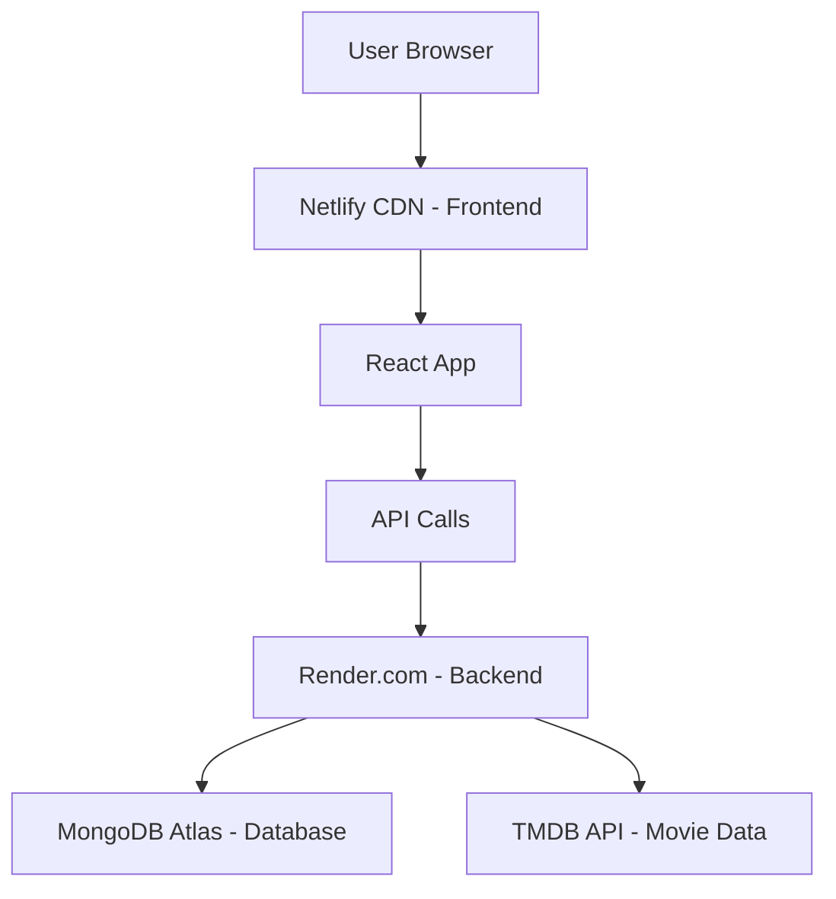

# 📋 COMPLETE STEP-BY-STEP DEPLOYMENT PROCESS

## **Current Status Summary for khanyasir40**
- ✅ **Backend**: LIVE on Render.com at `https://moviefinal-backend-khanyasir40.onrender.com`
- 🔄 **Frontend**: IN PROGRESS on Netlify (fixing build configuration)
- 🎯 **Goal**: Complete full-stack deployment with global accessibility

---

## **🚀 STEP-BY-STEP PROCESS TO COMPLETION**

### **PHASE 1: CURRENT NETLIFY DEPLOYMENT (5-10 minutes)**

#### **Step 1: Monitor Current Netlify Build**
1. **Check Netlify Dashboard**:
   - Go to your Netlify site dashboard
   - Look for the latest deployment (should be auto-triggered from recent GitHub push)
   - Current build should now work with updated configuration

2. **Expected Build Process**:
   ```
   Step 1: Clone repository from GitHub
   Step 2: Run "npm run build" (from root package.json)
   Step 3: Execute "cd client && npm install && npm run build"
   Step 4: Create optimized production build
   Step 5: Deploy to client/build directory
   Step 6: Publish to Netlify CDN
   ```

3. **If Build Succeeds**:
   - ✅ Proceed to Step 2
   - ✅ Your app will be live!

4. **If Build Still Fails**:
   - ❌ Go to Alternative Method (Step 7)

#### **Step 2: Configure Environment Variables**
1. **In Netlify Dashboard**:
   - Go to Site Settings → Environment Variables
   - Add these variables:
     ```
     REACT_APP_API_URL = https://moviefinal-backend-khanyasir40.onrender.com
     REACT_APP_NODE_ENV = production
     CI = false
     NODE_VERSION = 18
     ```

2. **Trigger Redeploy**:
   - Click "Trigger deploy" → "Deploy site"
   - Wait 3-5 minutes for completion

#### **Step 3: Test Frontend Deployment**
1. **Access Your Live URL**:
   - Copy the Netlify URL (format: `https://[random-name].netlify.app`)
   - Open in browser

2. **Verify Functionality**:
   - ✅ Homepage loads
   - ✅ Movies display (from backend API)
   - ✅ Navigation works
   - ✅ Search functionality
   - ✅ User registration/login

#### **Step 4: Custom Domain Setup (Optional)**
1. **In Netlify Dashboard**:
   - Go to Domain Management
   - Add custom domain if desired
   - Configure DNS settings

---

### **PHASE 2: VERIFICATION AND TESTING (10-15 minutes)**

#### **Step 5: Full System Testing**
1. **Backend API Testing**:
   ```bash
   # Test health endpoint
   curl https://moviefinal-backend-khanyasir40.onrender.com/health
   
   # Test movies endpoint
   curl https://moviefinal-backend-khanyasir40.onrender.com/api/movies/trending
   
   # Test user endpoints
   curl https://moviefinal-backend-khanyasir40.onrender.com/api/users
   ```

2. **Frontend Integration Testing**:
   - Register new user account
   - Login functionality
   - Browse movies by category
   - Search for specific movies
   - Add movies to favorites
   - Test responsive design (mobile/tablet)

3. **Cross-Browser Testing**:
   - Chrome, Firefox, Safari, Edge
   - Mobile browsers (iOS Safari, Android Chrome)

#### **Step 6: Performance and Security Verification**
1. **Performance Check**:
   - Page load speed (should be <3 seconds)
   - API response times
   - Image loading optimization

2. **Security Verification**:
   - HTTPS encryption enabled
   - Environment variables secure
   - API endpoints protected
   - User authentication working

---

### **PHASE 3: ALTERNATIVE METHOD (If Netlify Fails)**

#### **Step 7: Deploy to Vercel (Backup Plan)**
1. **Create Vercel Account**:
   - Go to https://vercel.com
   - Sign up with GitHub

2. **Import Project**:
   - Click "New Project"
   - Import `khanyasir40/moviefinal`
   - Configure settings:
     ```
     Framework: Create React App
     Root Directory: client
     Build Command: npm run build
     Output Directory: build
     ```

3. **Environment Variables**:
   ```
   REACT_APP_API_URL = https://moviefinal-backend-khanyasir40.onrender.com
   REACT_APP_NODE_ENV = production
   ```

4. **Deploy and Test**

#### **Step 8: Deploy to GitHub Pages (Final Backup)**
1. **Install gh-pages**:
   ```bash
   cd client
   npm install --save-dev gh-pages
   ```

2. **Update package.json**:
   ```json
   {
     "homepage": "https://khanyasir40.github.io/moviefinal",
     "scripts": {
       "predeploy": "npm run build",
       "deploy": "gh-pages -d build"
     }
   }
   ```

3. **Deploy**:
   ```bash
   npm run deploy
   ```

---

### **PHASE 4: FINAL DOCUMENTATION AND HANDOVER**

#### **Step 9: Create Deployment Documentation**
1. **Live URLs Documentation**:
   ```
   🎬 Frontend: [Your Netlify/Vercel URL]
   ⚡ Backend: https://moviefinal-backend-khanyasir40.onrender.com
   📊 Health Check: https://moviefinal-backend-khanyasir40.onrender.com/health
   ```

2. **User Guide Creation**:
   - How to access the app
   - Feature explanations
   - Troubleshooting guide

#### **Step 10: Repository Organization**
1. **Create Final README.md**:
   - Project description
   - Live demo links
   - Local setup instructions
   - Deployment guide

2. **Archive Deployment Files**:
   - Keep deployment configurations
   - Document environment variables
   - Store deployment scripts

#### **Step 11: Global Access Verification**
1. **Test from Different Locations**:
   - Use VPN to test from different countries
   - Test on mobile networks
   - Verify CDN performance

2. **Monitor and Maintenance**:
   - Set up uptime monitoring
   - Configure error tracking
   - Plan for future updates

---

## **🎯 IMMEDIATE NEXT ACTIONS FOR YOU**

### **Right Now (Next 5 minutes):**
1. **Check Netlify Dashboard**:
   - Look for latest deployment status
   - Check if build is successful

2. **If Build Successful**:
   - Get your live URL
   - Test the application
   - Celebrate! 🎉

3. **If Build Failed**:
   - Screenshot the error
   - Share with me for immediate fix
   - We'll proceed with Vercel backup

### **Expected Timeline:**
- **5 minutes**: Netlify deployment completion
- **10 minutes**: Full testing and verification
- **15 minutes**: Documentation and final handover
- **20 minutes**: Your movie app fully deployed globally! 🌍

---

## **🔧 TECHNICAL ARCHITECTURE OVERVIEW**

### **Current Setup:**


### **Technology Stack:**
- **Frontend**: React 18, Material-UI, React Router
- **Backend**: Node.js, Express.js, JWT Authentication
- **Database**: MongoDB Atlas (Cloud)
- **APIs**: TMDB (The Movie Database)
- **Hosting**: Netlify (Frontend) + Render (Backend)
- **Domain**: Global CDN distribution

### **Security Features:**
- HTTPS encryption
- JWT token authentication
- Environment variable protection
- CORS configuration
- Input validation and sanitization

---

**STATUS: Phase 1 - Step 1 IN PROGRESS**
**NEXT: Check Netlify deployment status and proceed accordingly**